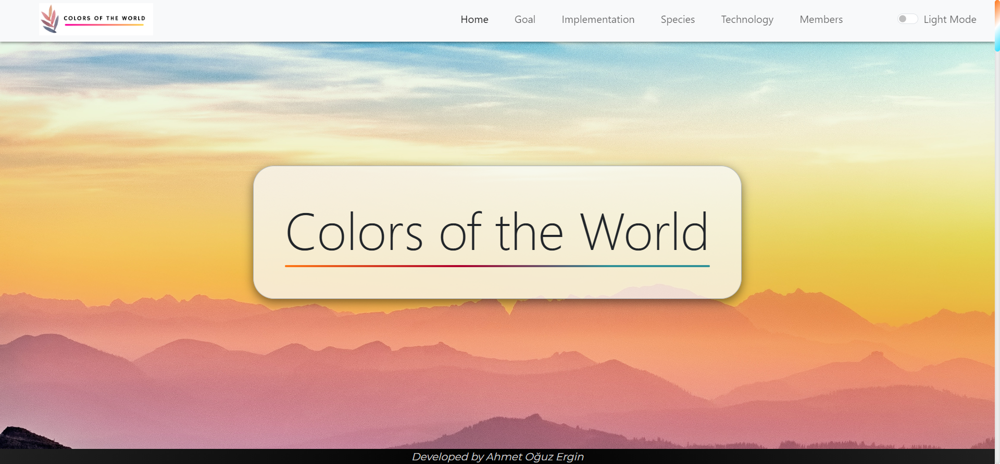

<h1 align="center">Colors of the World</h1>  

    

 

## Table of Contents

- [Demo](#demo)
- [Introduction](#introduction)
- [Technologies](#technologies)
- [Features](#features)
- [Contributors](#contributors)

 

## Demo

<a href="https://ahmettoguz.github.io/Colors_Of_The_World/" target="_blank">Visit https://ahmettoguz.github.io/Colors_Of_The_World/</a>

    

 

## Introduction

As Bilkent students, we have prepared an SDG (Sustainable Development Goals) project. I have developed the website for this project. You can access the website through the link provided in the demo and find detailed information about the project. Also you can examine the members of the project from Member page in detail for the Colors of the World project.

 

## Technologies

* HTML
* JavaScript
* Css, Bootstrap

 

## Features

* Responsive pages developed for every screen sizes.
* Dark and light modes provided.
* There are special animations for every pages.
* Home page has scroll animation.

 

## Contributors

